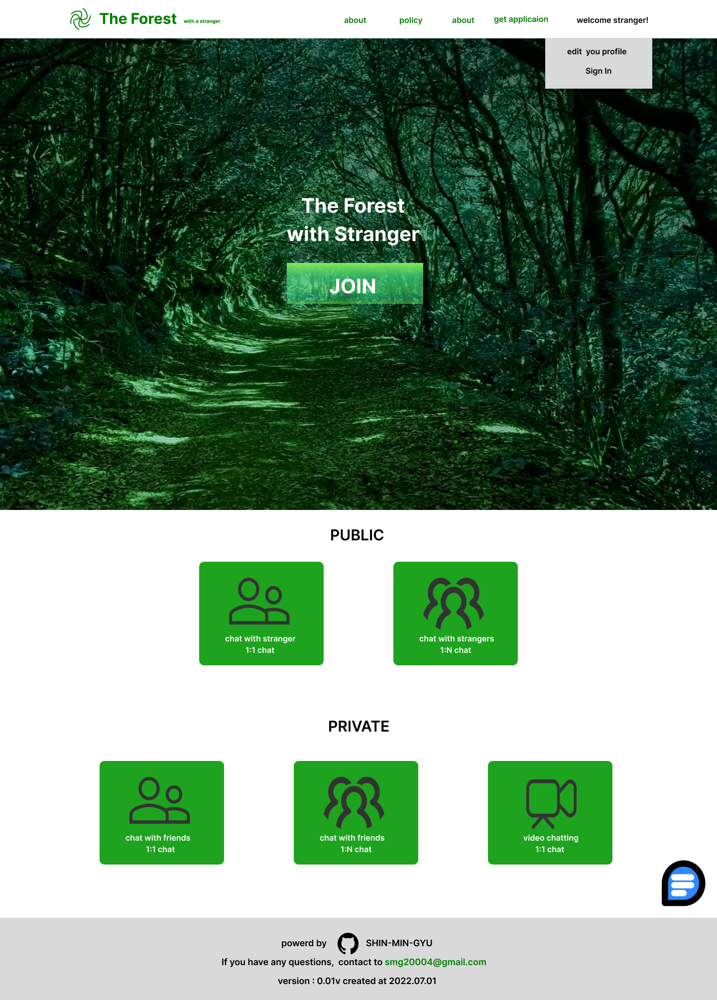

# THE FOREST with stranger

</img>

<h1>1.Indroduction</h1>

### The Forest with stranger  is chatting web for people who stay home all the time

Have you ever stayed home the whole time? then, hang out with us and make freinds!

<h1>2. Function</h1>

1. Public 1. Chat with stranger(1:1 chat) 2. Chat with strangers(group chat)
    

2. Private
   1. Chat with friends(1:1 chat)
   2. Chat with friends(group chat)
   3. Video chat(video chat)

<h1>3. Tech STACK </h1>
 
</a>
</a>
</a>
</a>
</a>
</a>
</a>
</a>
